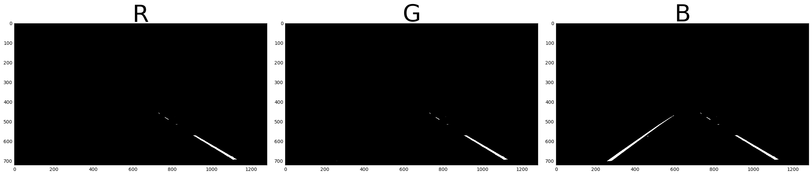
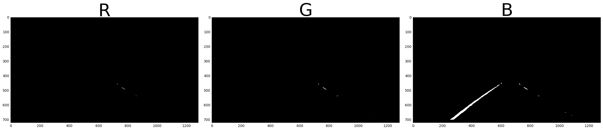
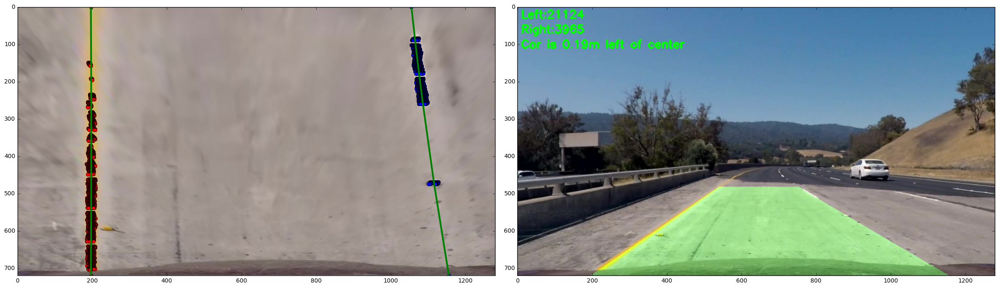

## Advanced Lane Finding 

The goals of this project is find road lane lines in a video stream and overlay the lines with a computed polynomial curve. 
In order to achieve this goal, methods and classes were built to do the following:

Compute the camera calibration matrix and distortion coefficients given a set of chessboard images.
Apply a distortion correction to raw images.
Use color transforms, gradients (Sobel), to create a thresholded binary image.
Apply a perspective transform to rectify binary image ("birds-eye view").
Detect lane pixels and fit to find the lane boundary.
Determine the curvature of the lane and vehicle position with respect to center.
Warp the detected lane boundaries back onto the original image.
Output visual display of the lane boundaries and numerical estimation of lane curvature and vehicle position.

This jupyter notebook breaks down all the steps and display the output from each step. There is a separate pipeline written in notebook that combines all the steps with the same configuration and applies averaging techniques for the test video.


```python
import numpy as np
import cv2
import matplotlib.pyplot as plt
import matplotlib.image as mpimg 
import glob
import math
from skimage.feature import corner_harris,corner_peaks
from moviepy.editor import VideoFileClip
from IPython.display import HTML
%matplotlib qt
%matplotlib inline

```

## Performing camera calibration 

Camera calibration is performed in order to correct the deformation in the images that is caused to the optic lens curvature. The first step is to print a chessboard and take random pictures of it. Then count the chess intersecting squires to provide "objp" which holds the (x,y,z) coordinates of these corners. Z=0 here and the object points are the same for all images in the calibration folder. The objpoints will be appended in "objp"  every time the method successfully detect all chessboard corners in a test image. "imgpoints" will be appended with the (x, y) pixel position of each of the corners in the image plane with each successful chessboard detection.

"objpoints" and "imgpoints" were used to compute the camera calibration and distortion coefficients using the "cv2.calibrateCamera()" function on a test image in "cv2.undistort()" 


```python
# prepare object points. The number of corners are 6x9
objp = np.zeros((6*9,3), np.float32)
objp[:,:2] = np.mgrid[0:9, 0:6].T.reshape(-1,2)
# Arrays to store object points and image points from all the images.
objpoints = [] # 3d points in real world space
imgpoints = [] # 2d points in image plane.
# Make a list of calibration images, all located in camera_cal
images = glob.glob('camera_cal/calibration*.jpg')
# Step through the list and search for chessboard corners
for idx, fname in enumerate(images):
    img = cv2.imread(fname)
    # imread reads images in BGR format
    gray = cv2.cvtColor(img, cv2.COLOR_BGR2GRAY)
    # Find the chessboard corners
    ret, corners = cv2.findChessboardCorners(gray, (9,6), None)
    # If found, add object points, image points
    if ret == True:
        objpoints.append(objp)
        imgpoints.append(corners)
        #Draw and display the corners
        cv2.drawChessboardCorners(img, (9,6), corners, ret)
        #write_name = 'corners_found'+str(idx)+'.jpg'
        #cv2.imwrite(write_name, img)
        #cv2.imshow('img', img)
        #cv2.waitKey(500)
cv2.destroyAllWindows()
```

## Perform distortion removal on test images 
### 1. Has the distortion correction been correctly applied to each image?

Undistortion is performed on the provided test images before they are used in the pipeline. This also applies to the video frames. "dst" holds undistorted frames from "cv2.undistort" that were computed using "mtx".


```python
#Implement calibration on the images that will be used
def undistort(img, read=True, display=True, write=False):

# Test undistortion on an image
    
    if read:
        img = cv2.imread(img)
    img_size = (img.shape[1], img.shape[0])
#img = cv2.cvtColor(dst, cv2.COLOR_BGR2RGB)
# Do camera calibration given object points and image points
    ret, mtx, dist, rvecs, tvecs = cv2.calibrateCamera(objpoints, imgpoints, img_size,None,None)
    dst = cv2.undistort(img, mtx, dist, None, mtx)
#dst = cv2.cvtColor(dst, cv2.COLOR_RGB2BGR)
    if write:
        cv2.imwrite('test_images/test6.jpg',dst)
# Save the camera calibration result for later use (we won't worry about rvecs / tvecs)
#dist_pickle = {}
#dist_pickle["mtx"] = mtx
#dist_pickle["dist"] = dist
#pickle.dump( dist_pickle, open( "calibration_wide/wide_dist_pickle.p", "wb" ) )
#dst = cv2.cvtColor(dst, cv2.COLOR_BGR2RGB)
# Visualize undistortion
    if display:
        f, (ax1, ax2) = plt.subplots(1, 2, figsize=(20,10))
        img_RGB=cv2.cvtColor(img, cv2.COLOR_BGR2RGB)
        ax1.imshow(img_RGB)
        ax1.set_title('Original Image', fontsize=30)
        dst_RGB=cv2.cvtColor(dst, cv2.COLOR_BGR2RGB)
        ax2.imshow(dst_RGB)
        ax2.set_title('Undistorted Image', fontsize=30)
    else:
        return dst
```


```python

```

## Image preprocessing and filtering
### 2. Has a binary image been created using color transforms, gradients or other methods?
Before finding the lane lines in the images, it's very important to perform further preprocessing. It's also helpful to take advantage of some properties found in 3 channel images such as color segmentation. I've tested 6 image filtering methods

1- Gaussian blurring

2- Gradients threshold

3- RGB splitting and thresholding

4- HLS splitting and thresholding

5- Magnitude thresholding

6- Edge detection (Sobel)

1- "cv2.GaussianBlur"  was applied to smooth all images and the images where converted to gray scale using "cv2.COLOR_RGB2GRAY". 
2- The thresholded binary image is finally shown in the figures below. Several thresholding ranges were tested and finally I determined that the range "thresh = (190, 255)" is bust suited for these images.


```python
def gaussian_noise(img, kernel_size):
    """Applies a Gaussian Noise kernel"""
    
    return cv2.GaussianBlur(img, (kernel_size, kernel_size), 0)


def region_of_interest(img, vertices):
    """
    Applies an image mask.
    Only keeps the region of the image defined by the polygon
    formed from `vertices`. The rest of the image is set to black.
    """
    #defining a blank mask to start with
    mask = np.zeros_like(img)   
    #defining a 3 channel or 1 channel color to fill the mask with depending on the input image
    if len(img.shape) > 2:
        channel_count = img.shape[2]  # i.e. 3 or 4 depending on your image
        ignore_mask_color = (255,) * channel_count
    else:
        ignore_mask_color = 255   
    #filling pixels inside the polygon defined by "vertices" with the fill color    
    cv2.fillPoly(mask, vertices, ignore_mask_color)
    #returning the image only where mask pixels are nonzero
    masked_image = cv2.bitwise_and(img, mask)
    return masked_image

def inverse_region_of_interest(img, vertices):
    """
    Applies an image mask.
    Only keeps the region of the image defined by the polygon
    formed from `vertices`. The rest of the image is set to black.
    """
    #defining a blank mask to start with
    mask = np.zeros_like(img)   
    #defining a 3 channel or 1 channel color to fill the mask with depending on the input image
    if len(img.shape) > 2:
        channel_count = img.shape[2]  # i.e. 3 or 4 depending on your image
        ignore_mask_color = (255,) * channel_count
    else:
        ignore_mask_color = 255   
    #filling pixels inside the polygon defined by "vertices" with the fill color    
    cv2.fillPoly(mask, vertices, ignore_mask_color)
    #returning the image only where mask pixels are nonzero
    masked_image = cv2.bitwise_or(mask, img)
    inverse_masked_image = cv2.bitwise_not(masked_image , img)
     
    #return masked_image
    return inverse_masked_image

def transform(img):
    imshape = img.shape
    img_size = (img.shape[1], img.shape[0])
  
    
    src = np.float32([[490, 482],[810, 482],
                      [1250, 720],[40, 720]])
    dst = np.float32([[0, 0], [1280, 0], 
                     [1250, 720],[40, 720]])
    
    
    M = cv2.getPerspectiveTransform(src, dst)
    Minv = cv2.getPerspectiveTransform(dst, src)
    wraped =  cv2.warpPerspective(img,M,img_size, flags=cv2.INTER_LINEAR)
    
    return  Minv, wraped

```


```python
#test_image = cv2.imread('Frames/scene00161.jpg')
#Minv, warped = transform(test_image)
#plt.imshow(cv2.cvtColor(warped, cv2.COLOR_BGR2RGB))
 
```


```python
#Read in the image
def gradients(img, read=True, display=True,  thresh = (190, 255)):
#image = mpimg.imread('Frames/scene00181.jpg')
    if read:
        image = undistort(img, display = False)
        #image = mpimg.imread(img)
#Blur the image
    blur_kernel_size = 1
    image = gaussian_noise(image, blur_kernel_size)
#Define a mask but only implement it after edge detection dot not be detected
    imshape = image.shape
        #vertices = np.array([[(80,imshape[0]),(400, 330), (580, 330), (imshape[1],imshape[0])]], dtype=np.int32)
    vertices = np.array([[(160,imshape[0]),(imshape[1]/2-70, imshape[0]/2+90),
                      (imshape[1]/2+130, imshape[0]/2+90), (imshape[1]-20,imshape[0])]], dtype=np.int32)
#vertices = np.array([[(160,imshape[0]),(imshape[1]/2-60, imshape[0]/2+90),
                  #(imshape[1]/2+100, imshape[0]/2+90), (imshape[1]-20,imshape[0])]], dtype=np.int32)
#image = region_of_interest(image, vertices)
   
    gray = cv2.cvtColor(image, cv2.COLOR_RGB2GRAY)
    binary = np.zeros_like(gray)
    binary[(gray > thresh[0]) & (gray <= thresh[1])] = 1
    if display:
        f, (ax1, ax2) = plt.subplots(1, 2, figsize=(24, 9))
        f.tight_layout()
        image=cv2.cvtColor(image, cv2.COLOR_BGR2RGB)
        ax1.imshow(image)
        ax1.set_title('Original Image', fontsize=50)
        ax2.imshow(binary, cmap='gray')
        ax2.set_title('Thresholded Gradient', fontsize=50)
        plt.subplots_adjust(left=0., right=1, top=0.9, bottom=0.)
    else: 
        return binary

```


```python
imgs = glob.glob('Frames/*.jpg')
for img in imgs:
    gradients(img)
```


```python
#vertices_small = np.array([[(300,imshape[0]),(imshape[1]/2-110, imshape[0]/2+200),
 #                 (imshape[1]/2+200, imshape[0]/2+200), (imshape[1]-150,imshape[0])]], dtype=np.int32)

 
```

3- I've separated the RGB channels and applied a threshold of "thresh = (220, 255)" to remove the noise and fine the lane lines in the images. I also applied a mask defined by "vertices" to select the lane lines and remove everything else in the image.  
I've determined that the color channel "R" is best in finding the lane lines.


```python

def RGB_img(image,read = True, display = True, thresh = () ):
    #vertices_small = np.array([[(300,imshape[0]),(imshape[1]/2-110, imshape[0]/2+200),
     #                 (imshape[1]/2+200, imshape[0]/2+200), (imshape[1]-150,imshape[0])]], dtype=np.int32)
    if read:
        image = undistort(image, display = False)    
# Splitting RGB Channels
    R = image[:,:,0]
    G = image[:,:,1]
    B = image[:,:,2]
    
    imshape = image.shape
    vertices = np.array([[(160,imshape[0]),(imshape[1]/2-70, imshape[0]/2+90),
                      (imshape[1]/2+130, imshape[0]/2+90), (imshape[1]-20,imshape[0])]], dtype=np.int32)
    #vertices = np.float32([[(490, 482),(810, 482),(1250, 720),(40, 720)]], dtype=np.int32)
    binary_R = np.zeros_like(R)
    binary_R[(R > thresh[0]) & (R <= thresh[1])] = 1
    binary_R= region_of_interest(binary_R, vertices)
#binary_R= inverse_region_of_interest(binary_R, vertices_small)
#binary_R= inverse_region_of_interest(binary_R, vertices_small)

    binary_G = np.zeros_like(G)
    binary_G[(G > thresh[0]) & (G <= thresh[1])] = 1
    binary_G= region_of_interest(binary_G, vertices)
#binary_G= inverse_region_of_interest(binary_G, vertices_small)
#binary_G= inverse_region_of_interest(binary_G, vertices_small)

    binary_B = np.zeros_like(B)
    binary_B[(B > thresh[0]) & (B <= thresh[1])] = 1
    binary_B= region_of_interest(binary_B, vertices)
#binary_B= inverse_region_of_interest(binary_B, vertices_small)
#binary_B= inverse_region_of_interest(binary_B, vertices_small)
    if display:
        f, (ax1, ax2, ax3) = plt.subplots(1, 3, figsize=(24, 9))
        f.tight_layout()
        ax1.imshow(binary_R, cmap='gray')
        ax1.set_title('R', fontsize=50)
        ax2.imshow(binary_G, cmap='gray')
        ax2.set_title('G', fontsize=50)
        ax3.imshow(binary_B, cmap='gray')
        ax3.set_title('B', fontsize=50)
    else: 
        return binary_R, binary_G, binary_B
```


```python
imgs = glob.glob('Frames/*.jpg')
for img in imgs:
    RGB_img(img, thresh =(220,255) )
```








4- After separating the HLS channels and applying the same mask channel "S" was found to be the best for finding the lane lines. Several thresholds were tested and the rand "thresh = (150, 255)" was best in finding the lanes.

```python

def HLS_img(image,read = True, display = True, thresh = ()):
    #vertices_small = np.array([[(300,imshape[0]),(imshape[1]/2-110, imshape[0]/2+200),
     #                 (imshape[1]/2+200, imshape[0]/2+200), (imshape[1]-150,imshape[0])]], dtype=np.int32)
    if read:
        image = undistort(image, display = False)    
# Splitting RGB Channels
    H = image[:,:,0]
    L = image[:,:,1]
    S = image[:,:,2]
    
    imshape = image.shape
    vertices = np.array([[(160,imshape[0]),(imshape[1]/2-70, imshape[0]/2+90),
                      (imshape[1]/2+130, imshape[0]/2+90), (imshape[1]-20,imshape[0])]], dtype=np.int32)
 
    binary_H = np.zeros_like(H)
    binary_H[(H > thresh[0]) & (H <= thresh[1])] = 1
    binary_H= region_of_interest(binary_H, vertices)
#binary_R= inverse_region_of_interest(binary_R, vertices_small)
#binary_R= inverse_region_of_interest(binary_R, vertices_small)

    binary_L = np.zeros_like(L)
    binary_L[(L > thresh[0]) & (L <= thresh[1])] = 1
    binary_L= region_of_interest(binary_L, vertices)
#binary_G= inverse_region_of_interest(binary_G, vertices_small)
#binary_G= inverse_region_of_interest(binary_G, vertices_small)

    binary_S = np.zeros_like(S)
    binary_S[(S > thresh[0]) & (S <= thresh[1])] = 1
    binary_S= region_of_interest(binary_S, vertices)
#binary_B= inverse_region_of_interest(binary_B, vertices_small)
#binary_B= inverse_region_of_interest(binary_B, vertices_small)
    if display:
        f, (ax1, ax2, ax3) = plt.subplots(1, 3, figsize=(24, 9))
        f.tight_layout()
        ax1.imshow(binary_H, cmap='gray')
        ax1.set_title('H', fontsize=50)
        ax2.imshow(binary_L, cmap='gray')
        ax2.set_title('L', fontsize=50)
        ax3.imshow(binary_S, cmap='gray')
        ax3.set_title('S', fontsize=50)
    else: 
        return binary_H, binary_L, binary_S
```


```python
imgs = glob.glob('Frames/*.jpg')
for img in imgs:
    HLS_img(img, thresh=(200,255))
```


```python

def Lab_img(image,read = True, display = True, thresh = ()):
    #vertices_small = np.array([[(300,imshape[0]),(imshape[1]/2-110, imshape[0]/2+200),
     #                 (imshape[1]/2+200, imshape[0]/2+200), (imshape[1]-150,imshape[0])]], dtype=np.int32)
    if read:
        image = undistort(image, display = False)    
# Splitting RGB Channels
    blur_kernel_size = 1
    image = gaussian_noise(image, blur_kernel_size)
    L = image[:,:,0]
    a = image[:,:,1]
    b = image[:,:,2]
    
    imshape = image.shape
    vertices = np.array([[(160,imshape[0]),(imshape[1]/2-70, imshape[0]/2+90),
                      (imshape[1]/2+130, imshape[0]/2+90), (imshape[1]-20,imshape[0])]], dtype=np.int32)
 
    binary_L = np.zeros_like(L)
    binary_L[(L > thresh[0]) & (L <= thresh[1])] = 1
    binary_L= region_of_interest(binary_L, vertices)
#binary_R= inverse_region_of_interest(binary_R, vertices_small)
#binary_R= inverse_region_of_interest(binary_R, vertices_small)

    binary_a = np.zeros_like(a)
    binary_a[(a > thresh[0]) & (a <= thresh[1])] = 1
    binary_a= region_of_interest(binary_a, vertices)
#binary_G= inverse_region_of_interest(binary_G, vertices_small)
#binary_G= inverse_region_of_interest(binary_G, vertices_small)

    binary_b = np.zeros_like(b)
    binary_b[(b > thresh[0]) & (b <= thresh[1])] = 1
    binary_b= region_of_interest(binary_b, vertices)
#binary_B= inverse_region_of_interest(binary_B, vertices_small)
#binary_B= inverse_region_of_interest(binary_B, vertices_small)
    if display:
        f, (ax1, ax2, ax3) = plt.subplots(1, 3, figsize=(24, 9))
        f.tight_layout()
        ax1.imshow(binary_L, cmap='gray')
        ax1.set_title('L', fontsize=50)
        ax2.imshow(binary_a, cmap='gray')
        ax2.set_title('a', fontsize=50)
        ax3.imshow(binary_b, cmap='gray')
        ax3.set_title('b', fontsize=50)
    else: 
        return binary_L, binary_a, binary_b
```


```python
imgs = glob.glob('Frames/*.jpg')
for img in imgs:
    Lab_img(img, thresh=(200,255))
```


5- Edge detection is a widely used method for finding features in images. Here I used Sobel edge detection "cv2.Sobel" using "thresh=(50, 100)" on the thresholded "S" and "R" images as well as the gradient and magnitude threshold images. The figure shows the output where Sobel filter and R channel "Sobel_binary_S" is the best in defining the lane lines.   


```python
## return sobel threshold
def abs_sobel_thresh(img, orient, sobel_kernel, sobel_thresh):
    # Convert to grayscale
    gray = cv2.cvtColor(img, cv2.COLOR_RGB2GRAY)
    # Apply x or y gradient with the OpenCV Sobel() function
    # and take the absolute value
    if orient == 'x':
        abs_sobel = np.absolute(cv2.Sobel(gray, cv2.CV_64F, 1, 0, ksize=sobel_kernel))
    if orient == 'y':
        abs_sobel = np.absolute(cv2.Sobel(gray, cv2.CV_64F, 0, 1, ksize=sobel_kernel))
    # Rescale back to 8 bit integer
    scaled_sobel = np.uint8(255*abs_sobel/np.max(abs_sobel))
    # Create a copy and apply the threshold
    binary_output = np.zeros_like(scaled_sobel)
    # Here I'm using inclusive (>=, <=) thresholds, but exclusive is ok too
    binary_output[(scaled_sobel >= sobel_thresh[0]) & (scaled_sobel <= sobel_thresh[1])] = 1
    #binary_output[(scaled_sobel >= thresh_min) & (scaled_sobel <= thresh_max)] = 1

    # Return the result
    return binary_output

## return mag_direction

def mag_thresh(img, sobel_kernel, mag_thresh):
    # Convert to grayscale
    gray = cv2.cvtColor(img, cv2.COLOR_RGB2GRAY)
    # Take both Sobel x and y gradients
    sobelx = cv2.Sobel(gray, cv2.CV_64F, 1, 0, ksize=sobel_kernel)
    sobely = cv2.Sobel(gray, cv2.CV_64F, 0, 1, ksize=sobel_kernel)
    # Calculate the gradient magnitude
    gradmag = np.sqrt(sobelx**2 + sobely**2)
    # Rescale to 8 bit
    scale_factor = np.max(gradmag)/255 
    gradmag = (gradmag/scale_factor).astype(np.uint8) 
    # Create a binary image of ones where threshold is met, zeros otherwise
    binary_output = np.zeros_like(gradmag)
    binary_output[(gradmag >= mag_thresh[0]) & (gradmag <= mag_thresh[1])] = 1

    # Return the binary image
    return binary_output

## return the gradient

def dir_threshold(img, sobel_kernel, thresh):
    # Apply the following steps to img
    # 1) Convert to grayscale
    gray = cv2.cvtColor(img, cv2.COLOR_RGB2GRAY)
    # 2) Take the gradient in x and y separately
    sobelx = cv2.Sobel(gray, cv2.CV_64F, 1, 0, ksize=sobel_kernel)
    sobely = cv2.Sobel(gray, cv2.CV_64F, 0, 1, ksize=sobel_kernel)
    # 3) Take the absolute value of the x and y gradients
    abs_sobelx=np.absolute(sobelx)
    abs_sobely=np.absolute(sobely)
    # 4) Use np.arctan2(abs_sobely, abs_sobelx) to calculate the direction of the gradient 
    dir_grad = np.arctan2(abs_sobely, abs_sobelx)
    # 5) Create a binary mask where direction thresholds are met
    binary_output = np.zeros_like(dir_grad)
    binary_output[(dir_grad >= thresh[0]) & (dir_grad <= thresh[1])] = 1
    # 6) Return this mask as your binary_output image
    #binary_output = np.copy(img) # Remove this line
    return binary_output
```


```python
def edge_detectors(img, display = True, read = True):

    if read:
        image = undistort(img, display = False) 
    blur_kernel_size = 1
    image = gaussian_noise(image, blur_kernel_size)
    imshape = image.shape
    vertices = np.array([[(160,imshape[0]),(imshape[1]/2-70, imshape[0]/2+90),
                      (imshape[1]/2+130, imshape[0]/2+90), (imshape[1]-20,imshape[0])]], dtype=np.int32)   
    ksize=3
    gradx = abs_sobel_thresh(image, orient='x', sobel_kernel=ksize, sobel_thresh=(20,100))
    gradx = region_of_interest(gradx, vertices)
    #gradx= inverse_region_of_interest(gradx, vertices_small)
    #gradx= inverse_region_of_interest(gradx, vertices_small)
    grady = abs_sobel_thresh(image, orient='y', sobel_kernel=ksize, sobel_thresh=(20,100))
    grady = region_of_interest(grady, vertices)
    #grady= inverse_region_of_interest(grady, vertices_small)
    #grady= inverse_region_of_interest(grady, vertices_small)
    mag_binary = mag_thresh(image, sobel_kernel=ksize, mag_thresh=(30,100))
    mag_binary = region_of_interest(mag_binary, vertices)
    #mag_binary= inverse_region_of_interest(mag_binary, vertices_small)
    #mag_binary= inverse_region_of_interest(mag_binary, vertices_small)
    dir_binary = dir_threshold(image, sobel_kernel=ksize, thresh=(100, np.pi/2)) 
    dir_binary = region_of_interest(dir_binary, vertices)
    #dir_binary= inverse_region_of_interest(dir_binary, vertices_small)
    #dir_binary= inverse_region_of_interest(dir_binary, vertices_small)
    if display:
        f, (ax1, ax2, ax3) = plt.subplots(1, 3, figsize=(24, 9))
        f.tight_layout()
        ax1.imshow(gradx, cmap='gray')
        ax1.set_title('SobelX', fontsize=50)
        ax2.imshow(mag_binary, cmap='gray')
        ax2.set_title('Magnitude', fontsize=50)
        ax3.imshow(dir_binary, cmap='gray')
        ax3.set_title('Gradient', fontsize=50)
    else: 
        return gradx, mag_binary, dir_binary
    

```


```python
imgs = glob.glob('Frames/*.jpg')
for img in imgs:
    edge_detectors(img)
```


```python
def combined_imgs(img, display = True):
      
    
    gradx, mag_binary, dir_binary = edge_detectors(img, display = False, read = True)
    binary_H, binary_L, binary_S = HLS_img(img,read = True, display = False, thresh = (230, 255))
    binary_R, binary_G, binary_B = RGB_img(img,read = True, display = False, thresh = (220, 255))
    binary_L, binary_a, binary_b = Lab_img(img,read = True, display = False, thresh = (200, 255))
    
    
    combined_B_b = np.zeros_like(binary_B)
    combined_B_b[(binary_B== 1) | (binary_b == 1)] = 1
    
    combined_S_b = np.zeros_like(binary_S)
    combined_S_b[(binary_S== 1) | (binary_b == 1)] = 1
    
    combined_S_B = np.zeros_like(binary_S)
    combined_S_B[(binary_S== 1) | (binary_B == 1)] = 1    
    
    if display:
        f, (ax1, ax2, ax3) = plt.subplots(1, 3, figsize=(24, 9))
        f.tight_layout()
        ax1.imshow(combined_B_b, cmap='gray')
        ax1.set_title('combined_B_b', fontsize=50)
        ax2.imshow(combined_S_b, cmap='gray')
        ax2.set_title('combined_S_b', fontsize=50)
        ax3.imshow(combined_S_B, cmap='gray')
        ax3.set_title('combined_S_B', fontsize=50)
    else: 
        return combined_B_b, combined_S_b, combined_S_B    
```


```python
imgs = glob.glob('Frames/*.jpg')
for img in imgs:
    combined_imgs(img)
```


## Perspective transform
### 3. Has a perspective transform been applied to rectify the image?
Image perceptive transform is the process with which the image is warped in order to be displayed from a different perspective. This process tuned useful in finding the lanelines. "cv2.getPerspectiveTransform" is used for performing the transform by providing the source and destination coordinates "src" and "dst". The figures below show the orginal binary image and the transformed one.

 


```python
def warp(img, display = True):
    
    combined_B_b, combined_S_b, combined_S_B = combined_imgs(img, display = False)
    Minv, warped_img= transform(combined_S_B)
    histogram = np.sum(warped_img[warped_img.shape[0]/2:,:], axis=0)
    if display:
        f, (ax1, ax2) = plt.subplots(1, 2, figsize=(24, 9))

        #plt.plot(histogram)
        ax1.plot( histogram)
        ax1.set_title('Histogram', fontsize=50)
        ax2.imshow(warped_img, cmap='gray')
        ax2.set_title('Warped Binary', fontsize=50)
    else:
        return warped_img
        
 
```


```python
imgs = glob.glob('Frames/*.jpg')
for img in imgs:
    warp(img)
```


## Locating the Lane Lines and Determine the Curvature

I have explored several methods for locating the lane lines in the images including

1- finding the histogram and applying a moving window to extract the lane lines.

2- finding the corners in the binary images and then covering them into arrays of coordinates

I have implemented a method for finding the histogram by using "np.sum(warped_img[warped_img.shape[0]/2:,:], axis=0)". I will not explain the approach followed for extracting the landlines from the histogram because I have ruled out this approach and used the second method. This decision was made after testing both methods and comparing the results. The code for finding the lanes using the histogram method was commented out below.

 

In the second approach I used Open CV "corner_peaks" and "corner_harris" to find the coordinates of detected lanes in the binary image. This method is better than the histogram method because is less computation demanding, faster, and more accurate in finding the lane lines. It also has "min_distance" attribute that gives me control over the smoothness of found lane lines and reducing noise from other detected objects. 
In order to identify the left and right lane lines, I applied a mask to divide the image into two equal regions and then computed "Harris" corner finding on each part separately. "corners_l" and "corners_r" are the two arrays containing the tuples for (x,y) coordinates in the left and right images. 


```python
"""
## define the left and right lane 
#Find the corners in the image and find their x and y coordinates. 
#warped_img = lines
row_w,col_w=warped_img.shape
warped_img_left=warped_img[0:row_w,0:math.ceil(col_w/2)]
warped_img_right=warped_img[0:row_w,math.ceil(col_w/2):col_w]
def show_corners(corners_l, corners_r,image,title=None):
    #Display a list of corners overlapping an image
    fig = plt.figure()
    plt.imshow(image,cmap='gray')
    y_corner_l,x_corner_l = zip(*corners_l)
    y_corner_r,x_corner_r = zip(*corners_r)
    plt.plot(x_corner_l,y_corner_l,'ro') # Plot corners
    plt.plot(x_corner_r,y_corner_r,'bo') # Plot corners
    if title:
        plt.title(title)
    plt.xlim(0,image.shape[1])
    plt.ylim(image.shape[0],0) # Images use weird axes
    fig.set_size_inches(np.array(fig.get_size_inches()) * 1.5)
    plt.show()
    print ("Number of left corners:",len(corners_l),"Number of right corners:",len(corners_r), )    
corners_left = corner_peaks(corner_harris(warped_img_left),min_distance=15)
corners_right = corner_peaks(corner_harris(warped_img_right),min_distance=15)
show_corners(corners_left,corners_right+[0,math.ceil(col_w/2)],warped_img,title="corners found")    

"""
    
 
```


    '\n## define the left and right lane \n#Find the corners in the image and find their x and y coordinates. \n#warped_img = lines\nrow_w,col_w=warped_img.shape\nwarped_img_left=warped_img[0:row_w,0:math.ceil(col_w/2)]\nwarped_img_right=warped_img[0:row_w,math.ceil(col_w/2):col_w]\ndef show_corners(corners_l, corners_r,image,title=None):\n    #Display a list of corners overlapping an image\n    fig = plt.figure()\n    plt.imshow(image,cmap=\'gray\')\n    y_corner_l,x_corner_l = zip(*corners_l)\n    y_corner_r,x_corner_r = zip(*corners_r)\n    plt.plot(x_corner_l,y_corner_l,\'ro\') # Plot corners\n    plt.plot(x_corner_r,y_corner_r,\'bo\') # Plot corners\n    if title:\n        plt.title(title)\n    plt.xlim(0,image.shape[1])\n    plt.ylim(image.shape[0],0) # Images use weird axes\n    fig.set_size_inches(np.array(fig.get_size_inches()) * 1.5)\n    plt.show()\n    print ("Number of left corners:",len(corners_l),"Number of right corners:",len(corners_r), )    \ncorners_left = corner_peaks(corner_harris(warped_img_left),min_distance=15)\ncorners_right = corner_peaks(corner_harris(warped_img_right),min_distance=15)\nshow_corners(corners_left,corners_right+[0,math.ceil(col_w/2)],warped_img,title="corners found")    \n\n'


## Radius of curvature finding, interpolation and extrapolation

### 4. Have lane line pixels been identified in the rectified image and fit with a polynomial?

A second order polynomial is used to find the lane lines as accurately as possible with "polyfit". However, the output line extends only to the detected lane lines and sometimes doesn't pass through the entire masked image. Therefore the line is extrapolated by defining the min and max points in the y direction. The figure below shown a plot of the identified corners and the polynomial passing through them.
To find the curvature I've estimated 30/720  meters per pixel in y dimension and 3.7/700  meters per pixel in x dimension using the recommendations from the course materials.  Based on that I have also estimated the position of the car using “center = abs(640 – ((rightx_int+leftx_int)/2)*3.7/700)”. 
Further smoothing was carried out by averaging the polynomials in the pipeline that was used to output the video.


```python
def curve(warped_img, display = True, pipeline = True):
    
    #image = cv2.imread(img)
    if pipeline:
        warped_img = warp(warped_img, display = False)
    
#y_corner_l,x_corner_l = zip(*corners_left)
#adjusted_corners_right= corners_right+[0,math.ceil(col_w/2)]                                    
#y_corner_r,x_corner_r = zip(*adjusted_corners_right)
#Measuring Curvature
#yvalus = warped_img.shape[0]
#Represent lane-line pixels
#leftx = np.array(x_corner_l)
#lefty = np.array(y_corner_l)
#rightx = np.array(x_corner_r)
#righty = np.array(y_corner_r)
#########################################################
    rightx = []
    righty = []
    leftx = []
    lefty = []
    x, y = np.nonzero(np.transpose(warped_img))
    row_w,col_w=warped_img.shape
    col_w = math.floor(col_w/2)
    i = row_w
    j = col_w
    offset=25
    angle=90
    while j >= 0:
        histogram = np.sum(warped_img[j:i,:], axis=0)
        left_peak = np.argmax(histogram[:col_w])
        x_idx = np.where((((left_peak - offset) < x)&(x < (left_peak + offset))&((y > j) & (y < i))))
        x_window, y_window = x[x_idx], y[x_idx]
        if np.sum(x_window) != 0:
            leftx.extend(x_window.tolist())
            lefty.extend(y_window.tolist())
        right_peak = np.argmax(histogram[col_w:]) + col_w
        x_idx = np.where((((right_peak - offset) < x)&(x < (right_peak + offset))&((y > j) & (y < i))))
        x_window, y_window = x[x_idx], y[x_idx]
        if np.sum(x_window) != 0:
            rightx.extend(x_window.tolist())
            righty.extend(y_window.tolist())
        i -= angle
        j -= angle

    leftx = np.array(leftx)
    lefty = np.array(lefty)
    rightx = np.array(rightx)
    righty = np.array(righty)
    ###################################################
    # Fit a second order polynomial to each line
    left_fit = np.polyfit(lefty, leftx, 2)
    left_fitx = left_fit[0]*lefty**2 + left_fit[1]*lefty + left_fit[2]
    right_fit = np.polyfit(righty, rightx, 2)
    right_fitx = right_fit[0]*righty**2 + right_fit[1]*righty + right_fit[2]
    #Extrapolation fit the line in top and bottom
    right_fit = np.polyfit(righty, rightx, 2)
    right_fitx = right_fit[0]*righty**2 + right_fit[1]*righty + right_fit[2]
    rightx_int = right_fit[0]*row_w**2 + right_fit[1]*row_w + right_fit[2]
    rightx = np.append(rightx,rightx_int)
    righty = np.append(righty, row_w)
    rightx = np.append(rightx,right_fit[0]*0**2 + right_fit[1]*0 + right_fit[2])
    righty = np.append(righty, 0)
    leftx_int = left_fit[0]*row_w**2 + left_fit[1]*row_w + left_fit[2]
    leftx = np.append(leftx, leftx_int)
    lefty = np.append(lefty, row_w)
    leftx = np.append(leftx,left_fit[0]*0**2 + left_fit[1]*0 + left_fit[2])
    lefty = np.append(lefty, 0)
    lsort = np.argsort(lefty)
    rsort = np.argsort(righty)
    lefty = lefty[lsort]
    leftx = leftx[lsort]
    righty = righty[rsort]
    rightx = rightx[rsort]
    left_fit = np.polyfit(lefty, leftx, 2)
    left_fitx = left_fit[0]*lefty**2 + left_fit[1]*lefty + left_fit[2]
    right_fit = np.polyfit(righty, rightx, 2)
    right_fitx = right_fit[0]*righty**2 + right_fit[1]*righty + right_fit[2]
    ########

    # Define y-value where we want radius of curvature
    # I'll choose the maximum y-value, corresponding to the bottom of the image
    y_eval_l = np.max(row_w)
    y_eval_r = np.max(row_w)
    left_curverad = ((1 + (2*left_fit[0]*y_eval_l + left_fit[1])**2)**1.5) \
                                 /np.absolute(2*left_fit[0])
    right_curverad = ((1 + (2*right_fit[0]*y_eval_r + right_fit[1])**2)**1.5) \
                                    /np.absolute(2*right_fit[0])
    

    # Define conversions in x and y from pixels space to meters
    ym_per_pix = 30/row_w # meters per pixel in y dimension
    xm_per_pix = 3.7/row_w # meteres per pixel in x dimension

    left_fit_cr = np.polyfit(lefty*ym_per_pix, leftx*xm_per_pix, 2)
    right_fit_cr = np.polyfit(righty*ym_per_pix, rightx*xm_per_pix, 2)
    left_curverad = ((1 + (2*left_fit_cr[0]*y_eval_l + left_fit_cr[1])**2)**1.5) \
                                 /np.absolute(2*left_fit_cr[0])
    right_curverad = ((1 + (2*right_fit_cr[0]*y_eval_r + right_fit_cr[1])**2)**1.5) \
                                    /np.absolute(2*right_fit_cr[0])
    center = abs((col_w - ((rightx_int+leftx_int)/2))*3.7/row_w)    
              # Calculate the position of the vehicle
    ## Radius of curvature finding, interpolation and extrapolation

                  # Calculate the position of the vehicle

    #img_size = (image.shape[1], image.shape[0])    
        # Now our radius of curvature is in meters
    #This part is for visualization, import images without binarization
    # undistort and wrap then overlay the detected lines
    image = undistort(img, read=True, display=False, write=False)
    imshape = image.shape
    vertices = np.array([[(160,imshape[0]),(imshape[1]/2-70, imshape[0]/2+90),
                      (imshape[1]/2+130, imshape[0]/2+90), (imshape[1]-20,imshape[0])]], dtype=np.int32)
    
          
    #orginal= region_of_interest(image, vertices)
    Minv, warped_orginal = transform(image)
    ##########################
    #Drawing the lines back down onto the road
    #mage called warped, and you have fit the lines with a polynomial and have arrays called yvals, 
    #left_fitx and right_fitx, 
    img_size = (image.shape[1], image.shape[0])
    # Create an image to draw the lines on
    warp_zero = np.zeros_like(warped_img).astype(np.uint8)
    color_warp = np.dstack((warp_zero, warp_zero, warp_zero))

    # Recast the x and y points into usable format for cv2.fillPoly()
    pts_left = np.array([np.transpose(np.vstack([left_fitx, lefty]))])
    pts_right = np.array([np.flipud(np.transpose(np.vstack([right_fitx, righty])))])
    pts = np.hstack((pts_left, pts_right))

    # Draw the lane onto the warped blank image
    cv2.fillPoly(color_warp, np.int_([pts]), (0,255, 0))

    # Warp the blank back to original image space using inverse perspective matrix (Minv)
    newwarp = cv2.warpPerspective(color_warp, Minv, (image.shape[1], image.shape[0])) 
    # Combine the result with the original image
    result = cv2.addWeighted(image, 1, newwarp, 0.3, 0)
    final_result=cv2.putText(result, "Left:{}".format(math.floor(left_curverad)),(10, 30), cv2.FONT_HERSHEY_SIMPLEX, 1.0, (0, 255, 0), 3)
    final_result=cv2.putText(result, "Right:{}".format(math.floor(right_curverad)),(10, 70), cv2.FONT_HERSHEY_SIMPLEX, 1.0, (0, 255, 0), 3)
    if center < 640:
            final_result=cv2.putText(result, "Car is {:.2f}m left of center".format(center),(10, 110), cv2.FONT_HERSHEY_SIMPLEX, 1.0, (0, 255, 0), 3)
    else:
            final_result=cv2.putText(result, "Car is {:.2f}m right of center".format(center),(10, 110), cv2.FONT_HERSHEY_SIMPLEX, 1.0, (0, 255, 0), 3)

    #plt.imshow(final_result)
########################################
    


    
    
    ###
    if display:
        f, (ax1, ax2) = plt.subplots(1, 2, figsize=(24, 9))   
        f.tight_layout()
        ax1.imshow(cv2.cvtColor(warped_orginal, cv2.COLOR_BGR2RGB))
        ax1.plot(leftx, lefty, 'o', color='red')
        ax1.plot(rightx, righty, 'o', color='blue')
        ax1.set_xlim(0, col_w*2)
        ax1.set_ylim(0, row_w)
        ax1.plot(left_fitx, lefty, color='green', linewidth=3)
        ax1.plot(right_fitx, righty, color='green', linewidth=3)
        ax1.invert_yaxis()
        ax2.imshow(cv2.cvtColor(final_result, cv2.COLOR_BGR2RGB))
    else:
        return  final_result
        
    
  

```


```python
imgs = glob.glob('Frames/*.jpg')
for img in imgs:
    curve(img)
```





### 5. Having identified the lane lines, has the radius of curvature of the road been estimated? And the position of the vehicle with respect to center in the lane?

Yes, the results were shown in the images.


```python
##final pipeline
class Left:
    def __init__(self):
        # Was the line found in the previous frame?
        self.found = False
        
        # Remember x and y values of lanes in previous frame
        self.X = None
        self.Y = None
        
        # Store recent x intercepts for averaging across frames
        self.x_int = []
        self.top = []
        
        # Remember previous x intercept to compare against current one
        self.lastx_int = None
        self.last_top = None
        
        # Remember radius of curvature
        self.radius = None
        
        # Store recent polynomial coefficients for averaging across frames
        self.fit0 = []
        self.fit1 = []
        self.fit2 = []
        self.fitx = None
        self.pts = []
        
        # Count the number of frames
        self.count = 0

        
class Right:
    def __init__(self):
        # Was the line found in the previous frame?
        self.found = False
        
        # Remember x and y values of lanes in previous frame
        self.X = None
        self.Y = None
        
        # Store recent x intercepts for averaging across frames
        self.x_int = []
        self.top = []
        
        # Remember previous x intercept to compare against current one
        self.lastx_int = None
        self.last_top = None
        
        # Remember radius of curvature
        self.radius = None
        
        # Store recent polynomial coefficients for averaging across frames
        self.fit0 = []
        self.fit1 = []
        self.fit2 = []
        self.fitx = None
        self.pts = []

def video_pipeline (image):
    #Step 1 undistort the image based on the camera calibration
    #image = cv2.imread(image)
    image = cv2.cvtColor(image, cv2.COLOR_RGB2BGR)
    image = undistort(image, read=False, display=False, write=False)
    #Step 2 Blur the image
    blur_kernel_size = 1
    image = gaussian_noise(image, blur_kernel_size)
    #Step 3 return RGB, HLS, and Lab image
    binary_R, binary_G, binary_B = RGB_img(image,read = False, display = False, thresh = (220,255))
    binary_H, binary_L, binary_S = HLS_img(image,read = False, display = False, thresh = (200,255))
    binary_L, binary_a, binary_b = Lab_img(image,read = False, display = False, thresh = (200,255))
    #Step 4 return combined images
    combined_B_b = np.zeros_like(binary_B)
    combined_B_b[(binary_B== 1) | (binary_b == 1)] = 1
    
    combined_S_b = np.zeros_like(binary_S)
    combined_S_b[(binary_S== 1) | (binary_b == 1)] = 1
    
    combined_S_B = np.zeros_like(binary_S)
    combined_S_B[(binary_S== 1) | (binary_B == 1)] = 1 
    #Step 5 Warp image 
    Minv, warped_img= transform(combined_S_B)
     
    #Step 6, line fitting
    #final_image = curve(warped_img, display = False, pipeline = False)
    rightx = []
    righty = []
    leftx = []
    lefty = []
    angle = 90
    # Find pixels in the binnary image
    x, y = np.nonzero(np.transpose(warped_img)) 

    if Left.found == True: # Search for left lane pixels around previous polynomial
        i = 720
        j = 630
        while j >= 0:
            yval = np.mean([i,j])
            xval = (np.mean(Left.fit0))*yval**2 + (np.mean(Left.fit1))*yval + (np.mean(Left.fit2))
            x_idx = np.where((((xval - 25) < x)&(x < (xval + 25))&((y > j) & (y < i))))
            x_window, y_window = x[x_idx], y[x_idx]
            if np.sum(x_window) != 0:
                np.append(leftx, x_window)
                np.append(lefty, y_window)
            i -= angle
            j -= angle
        if np.sum(leftx) == 0: 
            Left.found = False # If no lane pixels were detected then perform blind search
        
    if Right.found == True: # Search for right lane pixels around previous polynomial
        i = 720
        j = 630
        while j >= 0:
            yval = np.mean([i,j])
            xval = (np.mean(Right.fit0))*yval**2 + (np.mean(Right.fit1))*yval + (np.mean(Right.fit2))
            x_idx = np.where((((xval - 25) < x)&(x < (xval + 25))&((y > j) & (y < i))))
            x_window, y_window = x[x_idx], y[x_idx]
            if np.sum(x_window) != 0:
                np.append(rightx, x_window)
                np.append(righty, y_window)
            
            i -= angle
            j -= angle
        if np.sum(rightx) == 0:
            Right.found = False # If no lane pixels were detected then perform blind search
            
    if Right.found == False: # Perform blind search for lane lines
        i = 720
        j = 630
        while j >= 0:
            histogram = np.sum(warped_img[j:i,:], axis=0)
            right_peak = np.argmax(histogram[640:]) + 640
            x_idx = np.where((((right_peak - 25) < x)&(x < (right_peak + 25))&((y > j) & (y < i))))
            x_window, y_window = x[x_idx], y[x_idx]
            if np.sum(x_window) != 0:
                rightx.extend(x_window.tolist())
                righty.extend(y_window.tolist())
            i -= angle
            j -= angle
    if not np.sum(righty) > 0:
        righty = Right.Y
        rightx = Right.X
            
    if Left.found == False:# Perform blind search for lane lines
        i = 720
        j = 630
        while j >= 0:
            histogram = np.sum(warped_img[j:i,:], axis=0)
            left_peak = np.argmax(histogram[:640])
            x_idx = np.where((((left_peak - 25) < x)&(x < (left_peak + 25))&((y > j) & (y < i))))
            x_window, y_window = x[x_idx], y[x_idx]
            if np.sum(x_window) != 0:
                leftx.extend(x_window.tolist())
                lefty.extend(y_window.tolist())
            i -= angle
            j -= angle
    if not np.sum(lefty) > 0:
        lefty = Left.Y
        leftx = Left.X
        
    lefty = np.array(lefty).astype(np.float32)
    leftx = np.array(leftx).astype(np.float32)
    righty = np.array(righty).astype(np.float32)
    rightx = np.array(rightx).astype(np.float32)     
    # Calculate left polynomial fit based on detected pixels
    left_fit = np.polyfit(lefty, leftx, 2)
    
    # Calculate intercepts to extend the polynomial to the top and bottom of warped image
    leftx_int = left_fit[0]*720**2 + left_fit[1]*720 + left_fit[2]
    left_top = left_fit[0]*0**2 + left_fit[1]*0 + left_fit[2]
    
    # Average intercepts across 5 frames
    Left.x_int.append(leftx_int)
    Left.top.append(left_top)
    leftx_int = np.mean(Left.x_int)
    left_top = np.mean(Left.top)
    Left.lastx_int = leftx_int
    Left.last_top = left_top
    leftx = np.append(leftx, leftx_int)
    lefty = np.append(lefty, 720)
    leftx = np.append(leftx, left_top)
    lefty = np.append(lefty, 0)
    lsort = np.argsort(lefty)
    lefty = lefty[lsort]
    leftx = leftx[lsort]
    Left.X = leftx
    Left.Y = lefty
    
    # Recalculate polynomial with intercepts and average across 5 frames
    left_fit = np.polyfit(lefty, leftx, 2)
    Left.fit0.append(left_fit[0])
    Left.fit1.append(left_fit[1])
    Left.fit2.append(left_fit[2])
    left_fit = [np.mean(Left.fit0), 
                np.mean(Left.fit1), 
                np.mean(Left.fit2)]
    
    # Fit polynomial to detected pixels
    left_fitx = left_fit[0]*lefty**2 + left_fit[1]*lefty + left_fit[2]
    Left.fitx = left_fitx
    
    # Calculate right polynomial fit based on detected pixels
    right_fit = np.polyfit(np.int_(righty), np.int_(rightx), 2)

    # Calculate intercepts to extend the polynomial to the top and bottom of warped image
    rightx_int = right_fit[0]*720**2 + right_fit[1]*720 + right_fit[2]
    right_top = right_fit[0]*0**2 + right_fit[1]*0 + right_fit[2]
    
    # Average intercepts across 5 frames
    Right.x_int.append(rightx_int)
    rightx_int = np.mean(Right.x_int)
    Right.top.append(right_top)
    right_top = np.mean(Right.top)
    Right.lastx_int = rightx_int
    Right.last_top = right_top
    rightx = np.append(rightx, rightx_int)
    righty = np.append(righty, 720)
    rightx = np.append(rightx, right_top)
    righty = np.append(righty, 0)
    rsort = np.argsort(righty)
    righty = righty[rsort]
    rightx = rightx[rsort]
    Right.X = rightx
    Right.Y = righty
    
    # Recalculate polynomial with intercepts and average across 5 frames
    right_fit = np.polyfit(righty, rightx, 2)
    Right.fit0.append(right_fit[0])
    Right.fit1.append(right_fit[1])
    Right.fit2.append(right_fit[2])
    right_fit = [np.mean(Right.fit0), np.mean(Right.fit1), np.mean(Right.fit2)]
    
    # Fit polynomial to detected pixels
    right_fitx = right_fit[0]*righty**2 + right_fit[1]*righty + right_fit[2]
    Right.fitx = right_fitx
        
    # Compute radius of curvature for each lane in meters
    ym_per_pix = 30./720 # meters per pixel in y dimension
    xm_per_pix = 3.7/700 # meteres per pixel in x dimension
    left_fit_cr = np.polyfit(lefty*ym_per_pix, leftx*xm_per_pix, 2)
    right_fit_cr = np.polyfit(righty*ym_per_pix, rightx*xm_per_pix, 2)
    left_curverad = ((1 + (2*left_fit_cr[0]*np.max(lefty) + left_fit_cr[1])**2)**1.5) \
                                 /np.absolute(2*left_fit_cr[0])
    right_curverad = ((1 + (2*right_fit_cr[0]*np.max(lefty) + right_fit_cr[1])**2)**1.5) \
                                    /np.absolute(2*right_fit_cr[0])
        
    
    warp_zero = np.zeros_like(warped_img).astype(np.uint8)
    color_warp = np.dstack((warp_zero, warp_zero, warp_zero))
    pts_left = np.array([np.flipud(np.transpose(np.vstack([Left.fitx, Left.Y])))])
    pts_right = np.array([np.transpose(np.vstack([right_fitx, Right.Y]))])
    pts = np.hstack((pts_left, pts_right))
    cv2.polylines(color_warp, np.int_([pts]), isClosed=False, color=(0,0,255), thickness = 40)
    cv2.fillPoly(color_warp, np.int_(pts), (34,255,34))
    image = cv2.cvtColor(image, cv2.COLOR_BGR2RGB)
    newwarp = cv2.warpPerspective(color_warp, Minv, (image.shape[1], image.shape[0]))
    result = cv2.addWeighted(image, 1, newwarp, 0.5, 0)
    
    
    if len(Left.fit0) > 10:
        Left.fit0 = Left.fit0[1:]
    if len(Left.fit1) > 10:
        Left.fit1 = Left.fit1[1:]
    if len(Left.fit2) > 10:
        Left.fit2 = Left.fit2[1:]
    if len(Left.x_int) > 50:
        Left.x_int = Left.x_int[1:]
    if len(Left.top) > 50:
        Left.top = Left.top[1:]
    if len(Right.fit0) > 10:
        Right.fit0 = Right.fit0[1:]
    if len(Right.fit1) > 10:
        Right.fit1 = Right.fit1[1:]
    if len(Right.fit2) > 10:
        Right.fit2 = Right.fit2[1:]
    if len(Right.x_int) > 50:
        Right.x_int = Right.x_int[1:]
    if len(Right.top) > 50:
        Right.top = Right.top[1:]
        
    final_result=cv2.putText(result, "Left:{}".format(math.floor(left_curverad)),(10, 30), cv2.FONT_HERSHEY_SIMPLEX,1.0, (0, 255, 0), 3)
    final_result=cv2.putText(result, "Right:{}".format(math.floor(right_curverad)),(10, 70), cv2.FONT_HERSHEY_SIMPLEX,1.0, (0, 255, 0), 3)
    if distance_from_center < 640:
            final_result=cv2.putText(result, "Car is {:.2f}m left of center".format(distance_from_center),(10, 110), cv2.FONT_HERSHEY_SIMPLEX,1.0, (0, 255, 0), 3)
    else:
            final_result=cv2.putText(result, "Car is {:.2f}m right of center".format(distance_from_center),(10, 110), cv2.FONT_HERSHEY_SIMPLEX,1.0, (0, 255, 0), 3)    
   
    Left.count += 1
    return result
    
```


```python
Left.__init__(Left)
Right.__init__(Right)
video_output = 'challange_output.mp4'
clip1 = VideoFileClip("project_video.mp4")
white_clip = clip1.fl_image(video_pipeline) 
white_clip.write_videofile(video_output, audio=False)
```

    [MoviePy] >>>> Building video challange_output.mp4
    [MoviePy] Writing video challange_output.mp4

    [MoviePy] Done.
    [MoviePy] >>>> Video ready: challange_output.mp4 
    

[](https://youtu.be/-kFrO_kBkrI)


## Pipeline (video)
### 1. Does the pipeline established with the test images work to process the video?

Yes it does! The final results are shown in the video above.

## README

### 1. Has a README file been included that describes in detail the steps taken to construct the pipeline, techniques used, areas where improvements could be made?

In this project we are using colors and edges for finding the lanes. I have testes all color spaces available in CV2 and also tested several edge detection methods with many different threshold to determine the best method for lane detection in the road. It was challenging to find the best combination of settings and method to use i order to detect the lane lines as accurately as possible. The challenge test scenarios provided by Udacity were very challenging for my algorithm and improvements needed to improve its performance. The best achieved time for processing each frame on an i7 1.7 Ghz cpu was 1.1 seconds and I can improve the processing time by using GPUs instead of a 4 core cpu.  
Overall this project was fun and easy but required a lot of testing for finding the best line detection strategy. In the future I would implement deep learning and motion estimation for improving the lane line detection.   
